# Prometheus-Grafana Kubernetes Deployment

## Prerequisites
- Ubuntu 22.04 VMWare.
- Minikube and kubectl, Helm Installed

## 1. Set up Ubuntu 22.04 LTS
- Install Minikube:  
        ```curl -LO https://github.com/kubernetes/minikube/releases/latest/download/minikube-linux-amd64/```  
        ```sudo install minikube-linux-amd64 /usr/local/bin/minikube && rm minikube-linux-amd64```
- Install Docker:  
        ```sudo apt install docker.io -y```
    - Add the current user to the Docker group:  
            ```sudo usermod -aG docker $USER```
- Install kubectl:  
        ```curl -LO "https://dl.k8s.io/release/$(curl -L -s https://dl.k8s.io/release/stable.txt)/bin/linux/amd64/kubectl"```

## 2. Start minikube
- Start Minikube with Docker as the driver:  
        ```minikube start --vm-driver docker```
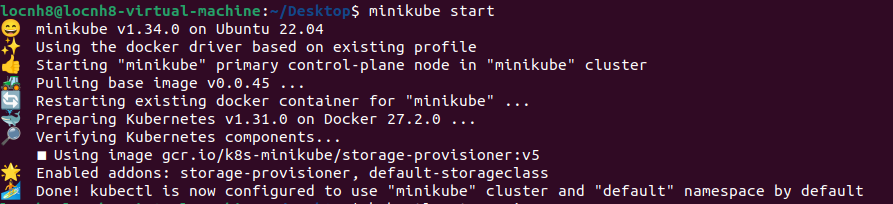
- To Check the status of Minikube:  
        ```minikube status```
        

## 3. Install the Helm
```curl -fsSL -o get_helm.sh https://raw.githubusercontent.com/helm/helm/main/scripts/get-helm-3```  
    - Change its permissions:  
            ```chmod 700 get_helm.sh```  
    - Install the helm:  
            ```./get_helm.sh```  
    - Check version:  
            ```helm version```
            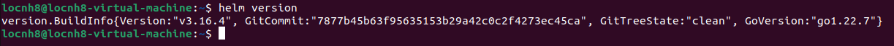
    - Add Prometheus Helm Chart Repository:  
            ```helm repo add prometheus-community https://prometheus-community.github.io/helm-charts```  
    - Update helm repo:  
            ```helm repo update```

## 4. Configure Prometheus and Grafana
- Create file:    
    ```touch custom-values.yaml```  
    ```nano custom-values.yaml```
    - Config:
    ```
    prometheus:
      service:
        type: NodePort
    grafana:
      service:
        type: NodePort
    ```
- Deploy the Prometheus and Grafana stack:  
                ```helm upgrade --install kube-prometheus-stack prometheus-community/kube-prometheus-stack -f custom-values.yaml```

## 5. Access Prometheus and Grafana
- List the services to get NodePort details:  
  ```kubectl get services```
  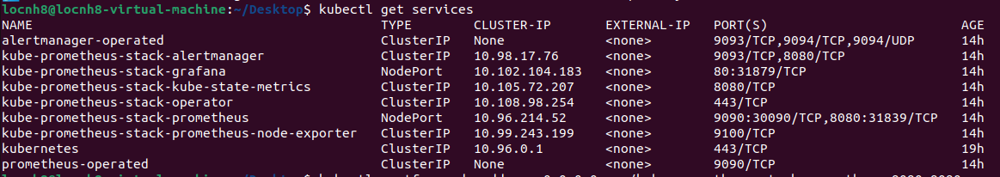
- Forward the Prometheus service to port 9090:  
  ```kubectl port-forward --address 0.0.0.0 svc/kube-prometheus-stack-prometheus 9090:9090```
  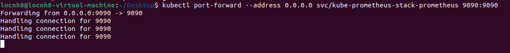
- Forward the Grafana service to port 3000:  
  ```kubectl port-forward --address 0.0.0.0 svc/kube-prometheus-stack-grafana 3000:80```
  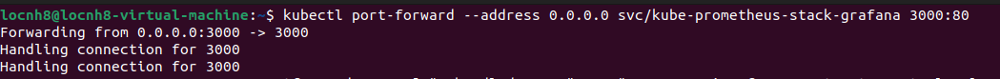
- Get username and password grafana:
  - username:  
      ```kubectl get secret --namespace default kube-prometheus-stack-grafana -o jsonpath="{.data.admin-user}" | base64 --decode ; echo```  
  - password:    
      ```kubectl get secret --namespace default kube-prometheus-stack-grafana -o jsonpath="{.data.admin-password}" | base64 --decode ; echo```

## Output
- UI Prometheus ```localhost:9090```:
        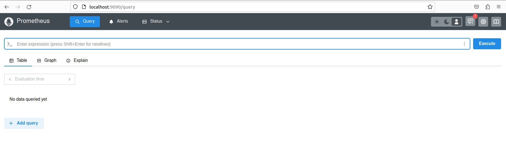
- UI Grafana ```localhost:3000```:
        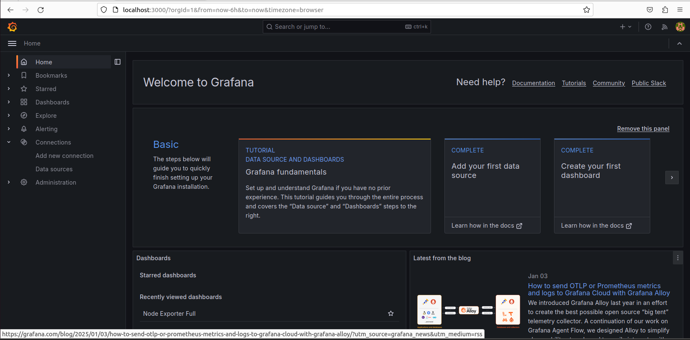
      - Create dashboard:
        1. Import dashboard:
                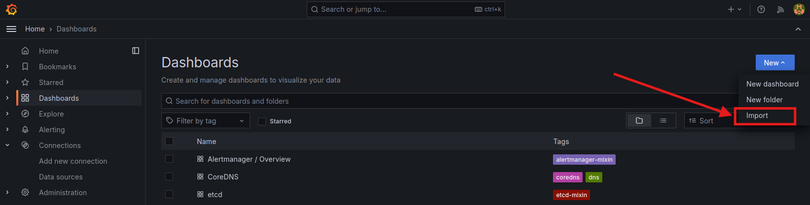
        2. Load dashboard: ```1860 (Node Exporter Full)```
                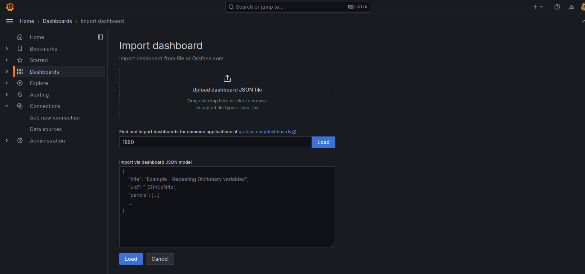
        3. Choose datasource Prometheus:
                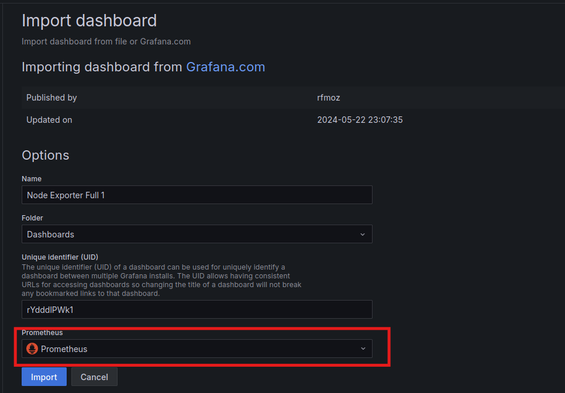
- Result:
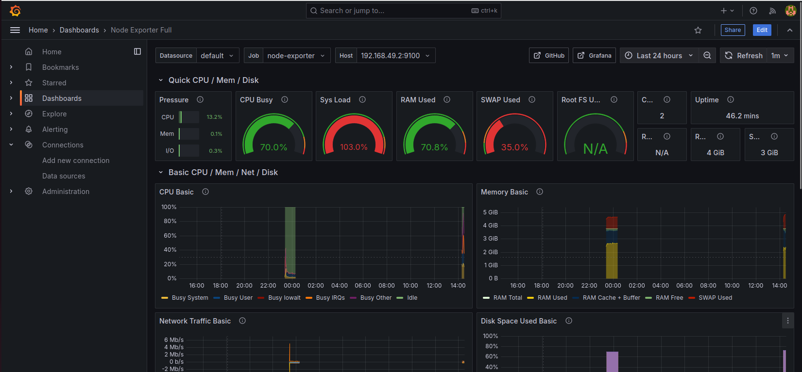 
